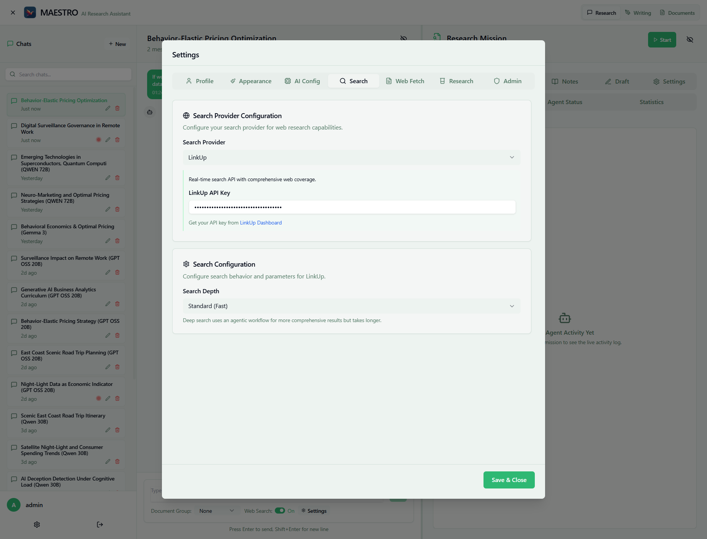
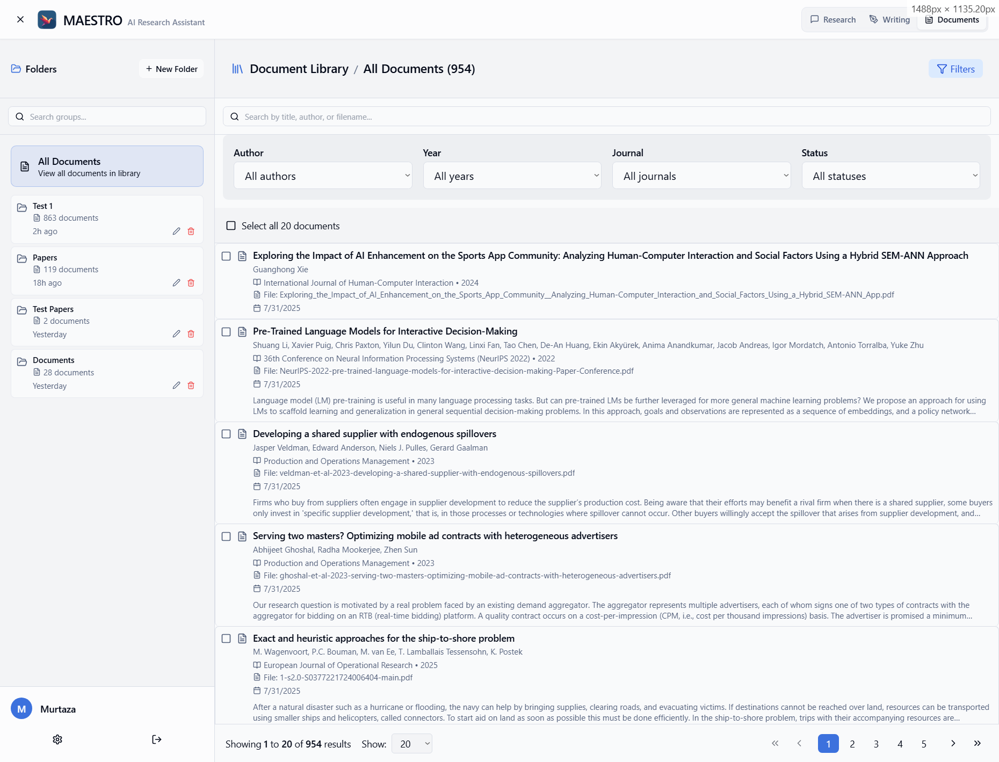

# First Login Guide

Welcome to MAESTRO! This guide walks you through your first login and initial setup to get you started quickly.

## Accessing MAESTRO

After installation, access MAESTRO through your web browser:

1. **Open your browser** (Chrome, Firefox, Safari, Edge)
2. **Navigate to** `http://localhost` (or the URL shown during setup)
3. **You'll see the login screen**

## Login Credentials

### Default Credentials

If you used the quick setup:

- **Username**: `admin`
- **Password**: `admin123`

### Custom Credentials

If you used the setup script:

- **Username**: `admin` (or what you configured)
- **Password**: Check your `.env` file for the password you set

```bash
# View your configured password
grep ADMIN_PASSWORD .env
```

## First-Time Setup Walkthrough

### Step 1: Change Default Password

**Critical Security Step!**

1. Click the **Settings** icon (gear) in the top-right
2. Navigate to **Profile** tab
3. Under "Change Password":
      - Enter current password (`admin123`)
      - Enter new strong password
      - Confirm new password
4. Click **"Change Password"** button

### Step 2: Configure AI Provider


1. Stay in Settings, click **AI Config** tab
2. Select your AI Provider:
      - **OpenRouter** - Access to 100+ models
      - **OpenAI** - GPT models
      - **Custom** - Any OpenAI compatible API Service or Local LLMs
3. Enter your **API Key**
4. Click **"Test"** to verify connection
5. Select models for each type:
      - **Fast Model** - Quick responses
      - **Mid Model** - Balanced performance
      - **Intelligent Model** - Complex tasks
      - **Verifier Model** - Fact-checking
6. Click **"Save & Close"**

### Step 3: Configure Search Provider (Optional)



1. Click **Search** tab in Settings
2. Select a search provider:
      - **Tavily** - AI-optimized search
      - **LinkUp** - Real-time web search
      - **Jina** - Advanced extraction
      - **SearXNG** - Privacy-focused
3. Enter API key (except SearXNG)
4. Configure search depth if needed
5. Click **"Save & Close"**

### Step 4: Upload Your First Documents



1. Navigate to **Documents** tab
2. Create a Document Group and Select it from the sidebar
3. Drag & drop files anywhere on screen:
      - PDFs, Word docs, Markdown, Text files
      - Multiple files can be dropped
5. Monitor processing status:
      - **Processing** - Being analyzed
      - **Completed** - Ready to use
      - **Failed** - Check error message

## Your First Research

### Quick Chat

1. Go to **Research** tab
2. Click **"New Chat"**
3. Type a question about any topic
4. Select either a document group or web search or both
5. Finalize questions with chat agent and define style, tone, or any other expectations or preferences
6. Instruct model to start research or press the start button
7. Monitor research progress in the various tabs
8. Final draft will be available in Draft tab

## Essential Settings

### Profile Settings

- Update your name and information to give model context
- Configure preferences

### Research Settings

- Adjust research depth
- Configure iterations
- Set result counts
- Choose presets for different tasks

### Advanced Configuration

- **Admin Settings** - User management (admin only)
- **Web Fetch** - Configure web content fetching

## Tips for Success

### Document Upload Best Practices

1. **Organize before uploading**
      - Create logical groups
      - Use descriptive filenames

2. **Supported formats**
      - PDF (with extractable text)
      - Word (.docx, .doc)
      - Markdown (.md)
      - Plain text (.txt)

3. **Processing time with GPU**
      - Small docs: 0.5-2 minutes
      - Large PDFs: 2-4 minutes
      - Batch uploads: Process overnight

## Common First-Time Issues

### Can't Login

**Issue**: Login fails with correct credentials

**Solutions**:

- Wait for backend to fully start (5-10 min first time)
- Check logs: `docker compose logs maestro-backend`. Wait for "MAESTRO Backend Started Successfully!" message.
- Verify services running: `docker compose ps`

### No Models Available

**Issue**: Model dropdowns are empty

**Solutions**:

- Verify API key is correct
- Test connection with "Test" button
- Check provider is accessible
- Try different provider

### Documents Won't Upload

**Issue**: Upload fails or stuck in processing

**Solutions**:

- Check file size (<50MB recommended)
- Ensure PDF has text (not scanned)
- Monitor logs for errors
- Try smaller test file first

### Search Not Working

**Issue**: No web search results

**Solutions**:

- Configure search provider in Settings
- Verify API key if required
- Check rate limits
- Try different provider

## Getting Help

### Documentation

- [User Guide](../user-guide/index.md) - Complete feature guide
- [Troubleshooting](../troubleshooting/index.md) - Problem solving
- [FAQ](../troubleshooting/faq.md) - Common questions

### Community Support

- [GitHub Issues](https://github.com/murtaza-nasir/maestro/issues) - Report bugs
- Check existing issues for solutions
- Provide detailed information when reporting

## Next Steps

Now that you're set up:

1. **Upload key documents** to build your library
2. **Test different queries** to understand capabilities
3. **Try a research mission** for deeper analysis
4. **Explore writing mode** for content creation
5. **Customize settings** for your workflow

## Quick Reference

### Keyboard Shortcuts

- **Enter** - Send message in chat
- **Shift+Enter** - New line in message
- **Escape** - Close dialogs
- **Ctrl/Cmd+K** - Quick search

### Status Indicators

- 🟢 **Green** - Active/Ready
- 🟡 **Yellow** - Processing/Waiting
- 🔴 **Red** - Error/Failed
- 🔵 **Blue** - Information

### Performance Tips

- Use appropriate models for tasks
- Process large batches overnight
- Monitor resource usage
- Clear old sessions periodically

Welcome to MAESTRO - your AI research assistant is ready to help!