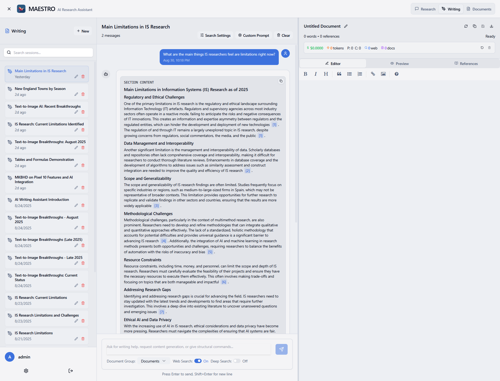
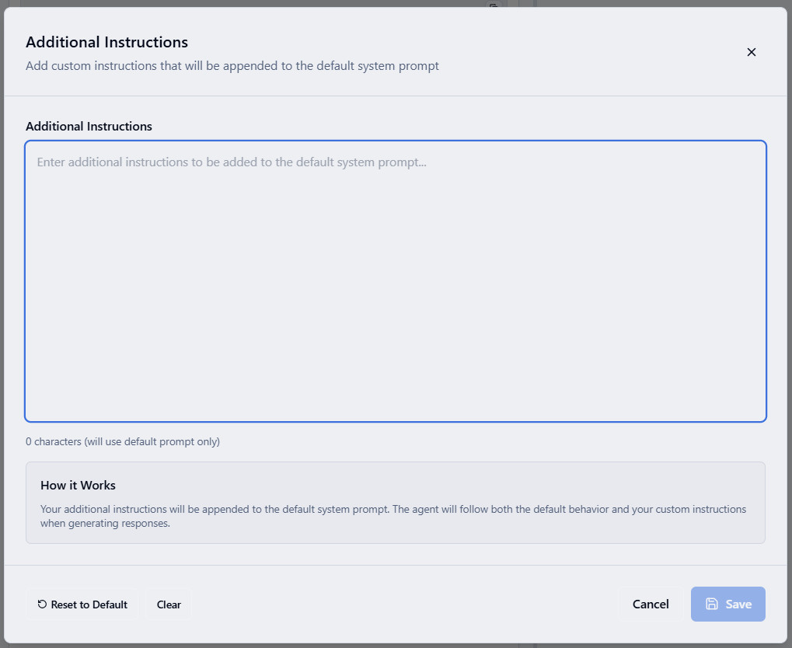
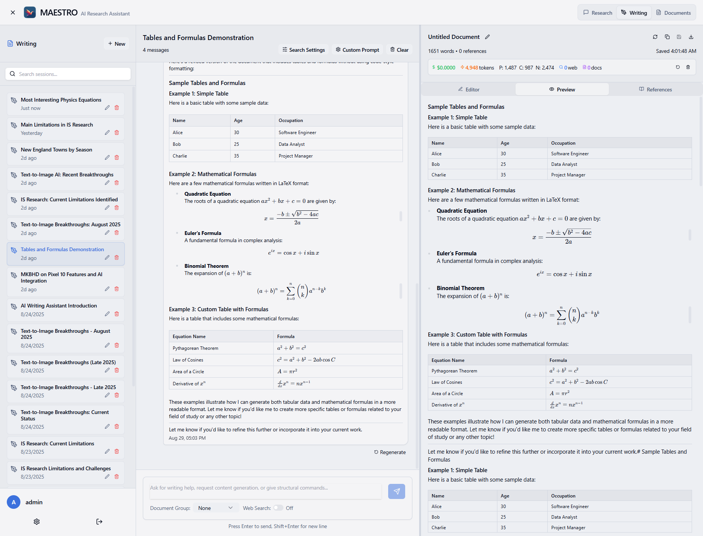

# Writing Mode Overview

MAESTRO's Writing Mode is a powerful AI-assisted writing environment that combines intelligent research capabilities with a full-featured markdown editor. It enables you to create well-researched documents with proper citations from both your document library and web sources.



## Core Features

### Dual-Pane Interface

The Writing Mode interface is divided into two synchronized panels:

**Left Panel - AI Writing Assistant**
- Interactive chat with the AI assistant for research and writing help
- Access to your document collections and web search
- Color-coded references distinguishing between document and web sources
- Contextual awareness of your current draft

**Right Panel - Markdown Editor**
- Full-featured markdown editor with live preview
- Support for LaTeX formulas and mathematical notation
- Tables, code blocks, and structured formatting
- Auto-save functionality preserving your work

## Getting Started

### Starting a Writing Session

1. Navigate to the **Writing** tab in MAESTRO
2. Click **"+ New"** to create a new writing session
3. Your session will appear in the left sidebar with an auto-generated title

### Configuring Your Research Sources

Before starting your research, configure your sources:

**Document Collections**
- Select a document group from your library to search within
- The assistant will search only within the selected collection
- Leave unselected to disable document search

**Web Search**
- Toggle "Enable Web Search" to search the internet
- The assistant will find and cite relevant web sources
- Web sources appear with distinct colored references

## Research and Writing Workflow

### 1. Setting Up Search Parameters


Click the gear icon to access **Writing Search Settings**:

**Basic Settings**
- **Enable Web Search**: Toggle web search on/off
- **Deep Search Mode**: Use multiple iterations with quality assessment for thorough research

**Regular Search Settings**
- **Maximum Iterations (1-5)**: Number of quality refinement attempts per search
- **Maximum Decomposed Queries (1-10)**: Number of focused searches to perform

For quick responses, use minimal settings (1 iteration, 3 queries). For comprehensive research, increase both values.

### 2. Adding Custom Instructions



Click **"Additional Instructions"** to provide persistent context:
- Writing style preferences (academic, technical, casual)
- Target audience specifications
- Tone and formatting requirements
- Any specific guidelines for the assistant

These instructions are appended to every request, ensuring consistent responses throughout your session.

### 3. Interacting with the Assistant

The AI assistant can help with:

**Research Tasks**
- Finding information from your documents
- Searching the web for current information
- Fact-checking and verification
- Gathering supporting evidence

**Writing Support**
- Generating content based on research
- Improving and revising text
- Creating structured outlines
- Suggesting transitions and connections

**Citation Management**
- Automatically citing sources used
- Color-coding references by type
- Providing clickable reference links
- Maintaining a bibliography

### 4. Understanding References


The assistant provides numbered references with color coding:
- **Blue references** `[1]` `[2]`: Links to document sources from your collection
- **Green references** `[3]` `[4]`: Links to web sources
- Each reference is clickable for verification
- All sources are listed at the end of each response

## Editor Features

### Markdown and LaTeX Support



The editor supports full markdown formatting plus LaTeX:

**Tables**
```markdown
| Name    | Age | Occupation        |
|---------|-----|-------------------|
| Alice   | 30  | Software Engineer |
| Bob     | 25  | Data Analyst      |
| Charlie | 35  | Project Manager   |
```

**Mathematical Formulas**
- Inline math: `$x = \frac{-b \pm \sqrt{b^2 - 4ac}}{2a}$`
- Display math: 
```latex
$$
(a + b)^n = \sum_{k=0}^{n} \binom{n}{k} a^{n-k} b^k
$$
```

**Code Blocks**
```python
def calculate_area(radius):
    return 3.14159 * radius ** 2
```

### Editor Toolbar

The editor provides quick formatting options:
- **Text Formatting**: Bold, Italic, Strikethrough
- **Headers**: H1-H6 heading levels
- **Lists**: Ordered and unordered lists
- **Quotes**: Block quotes for citations
- **Links**: Hyperlink insertion
- **Images**: Image embedding
- **Code**: Inline code and code blocks
- **Tables**: Table insertion wizard

### Real-time Preview

.png)

Toggle between:
- **Editor View**: Write and edit your content
- **Preview View**: See rendered markdown with formatted text, tables, and formulas
- **Split View**: Edit and preview side-by-side

## Advanced Features

### Document Context Awareness

The writing assistant has access to your current draft content, allowing it to:
- Provide suggestions based on what you've written
- Maintain consistency in tone and style
- Help with transitions between sections
- Suggest improvements to existing content

### Session Persistence

Your writing sessions are automatically saved with:
- Complete chat history
- All draft versions
- Search settings
- Custom instructions
- Referenced sources

### Export Options

Export your completed documents as:
- **Markdown (.md)**: Preserve all formatting
- **PDF**: Professional presentation with rendered LaTeX
- **HTML**: Web-ready with embedded styles
- **Word (.docx)**: For collaboration

## Best Practices

### Effective Research Queries

1. **Be Specific**: "Explain the economic impact of climate change on agriculture in Southeast Asia"
2. **Request Evidence**: "Find statistics about renewable energy adoption rates with sources"
3. **Ask for Structure**: "Create an outline for a report on machine learning in healthcare"

### Optimizing Search Performance

**For Quick Answers**
- Set iterations to 1
- Use 3 decomposed queries
- Disable deep search mode

**For Comprehensive Research**
- Set iterations to 3-5
- Use 5-10 decomposed queries
- Enable deep search mode
- Select relevant document groups

### Managing Long Documents

1. **Work in Sections**: Focus on one section at a time
2. **Regular Saves**: The editor auto-saves every 30 seconds
3. **Use Headers**: Organize with clear section headers
4. **Reference Tracking**: Add citations as you write

## Tips for Success

### Research Phase
- Start with broad searches to understand the topic
- Narrow down to specific aspects
- Verify important facts with multiple sources
- Save important findings in your draft immediately

### Writing Phase
- Use the assistant to expand bullet points
- Request different perspectives on arguments
- Ask for transitions between paragraphs
- Get help with introductions and conclusions

### Revision Phase
- Request clarity improvements
- Check for logical flow
- Verify all citations are included
- Ensure consistent tone throughout

## Common Use Cases

### Academic Writing
- Research papers with proper citations
- Literature reviews with source synthesis
- Thesis chapters with evidence support
- Grant proposals with data backing

### Professional Documents
- Technical documentation with accuracy
- Business reports with market data
- White papers with industry research
- Case studies with real examples

### Content Creation
- Blog posts with fact-checking
- Articles with expert sources
- Marketing content with statistics
- Educational materials with references

## Troubleshooting

### Search Issues
- **No results found**: Check document group selection and search settings
- **Irrelevant results**: Refine your query to be more specific
- **Slow searches**: Reduce the number of iterations and queries

### Editor Problems
- **Formatting not showing**: Check preview mode is enabled
- **LaTeX not rendering**: Verify formula syntax is correct
- **Lost work**: Check auto-save status and session history

### Assistant Responses
- **Generic answers**: Add more specific instructions
- **Missing citations**: Enable appropriate search sources
- **Wrong context**: Ensure document group is correctly selected

## Summary

MAESTRO's Writing Mode streamlines the research and writing process by:
- Providing intelligent research assistance with automatic citations
- Offering a powerful markdown editor with LaTeX support
- Maintaining context awareness throughout your writing session
- Supporting both document library and web research
- Enabling customization through search settings and instructions

Start with simple queries, gradually explore advanced features, and let the AI assistant help you create well-researched, properly cited documents efficiently.